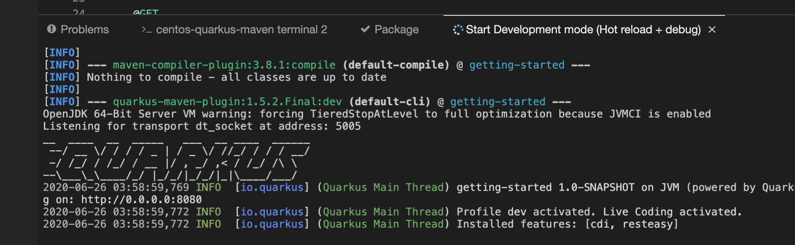

# CodeReady Workspaces (CRW) Starter Demo with Quarkus

This demo is a quick way to show off Eclipse Che or CRW.

The first part shows a demo with a Quarkus app and the second part shows how to use a factory url to open a workspace with one click.

Before you demo CRW, view this video and note the required messaging for the customer! 

* [Video presentation by Brad Micklea](https://my.allego.com/play.do?contentId=659233&sch=20921) - for CRW messaging

If you are in a hurry, you can demo without having to install CRW at all.   Go here: [https://che.openshift.io/](https://che.openshift.io/dashboard/#/) - log in with your RH access login (or RH developer login).

You will see your Workspaces, if you have any:

Click on "Get Started".   You will see some example workspaces. 

Filter by "Quarkus" and choose the "Quarkus Tools" sample to create a workspace.  

* It's a good idea to do this in advance of the demo because it can take about 2-3 mins to come up properly.  If there are any problems opening this workspace, I suggest opening it in advance on a separate tab as a backup!

You will see the new workspace: 

Open up some code to show:

On the right hand side, open up the menu and select "New Terminal" under centos-quarkus-maven.  A terminal window will open up at the bottom.  

Show that the terminal can be used to explore the source code:

Click on "Start Development Mode" to start the app for testing:

The app will launch in dev mode which means that any changes made to the code will automatically and immediately reflect in the running app:

Click on "Open Link" to view the app:

The app is running.   The path /hello/greeting/che-user  displays a simple greeting: 

Change the path to change the greeting response:

Go to the GreetingResource.java file and update the code.  Note, there is no need to save the files, all changes are saved automatically: 

Refresh the browser showing the running app to see the change instantly (no need to re-compile the quarkus app): 

**Other example demo using a Vote App "Factory URL"**

Open the URL [https://che.openshift.io/f?url=https://github.com/sjbylo/flask-vote-app](https://che.openshift.io/f?url=https://github.com/sjbylo/flask-vote-app) to open the workspace with just one click! (be sure to close the existing workspace as only one can be open at any time in che.openshift.io). 

This is really useful to quickly show an application to another team member, e.g. from a developer to a tester.  

The application workspace will be created and the app can be executed in a similar way to the above Quarkus app: 

Other features that can be shown include:

1. The ease of use of the modern editor, including short cuts and code completion

2. The search feature

3. Source control feature with git

---

**Miscellaneous**

If you want to demo CRW on your own OpenShift cluster or on an RHPDS cluster

Quick start:

1. Install the operator into a demo project - the Operator installs much like any other - Install works into any project, e.g. "workspaces".

2. Create a new project, e.g. "demo" and Install the "Che cluster" into the project.

3. On the OCP "CodeReady Workspaces Cluster Overview" page click on the route - wait for Status: available.

---

**Other useful content**

(note, some are internal access only)

1. [https://github.com/sjbylo/flask-vote-app](https://github.com/sjbylo/flask-vote-app) - the demo app

2. [RBAC](https://access.redhat.com/documentation/en-us/red_hat_codeready_workspaces/1.2/html-single/administration_guide/index#permissions) - establish a security model - allow certain actions by assigning permissions to users.

3. CRW Arch. [slide](https://docs.google.com/presentation/d/1WFRi9MZD3qksnEuAvgZpNrCjEf1PFLDMyxr-L2xThQA/edit#slide=id.g64798e8100_1_452)

4. CRW all in [One slide](https://docs.google.com/presentation/d/1Zklf--RjGchYD6qJDcVR7BT_s-mGTaRTsxBJvVTuYEM/edit#slide=id.g6beb2c4044_0_235)

5. CRW [OneStop](https://redhat.highspot.com/items/5c7fd4a981171734ea321621#1)

6. CRW [FAQ](https://docs.google.com/document/d/174USXEPCzTxz-piEk0CaOMzr2R1KhU7-1P7TEG0bBMc/edit#)

7. [videos](https://www.youtube.com/playlist?list=PLf3vm0UK6HKpBA8nWWO--6HtzKm6trH7-) (by Veer Muchandi)

8. [End-user doc](https://access.redhat.com/documentation/en-us/red_hat_codeready_workspaces/2.0/html-single/end-user_guide/index)

9. [doc2.1](https://access.redhat.com/documentation/en-us/red_hat_codeready_workspaces/2.1/html/installation_guide/index) (May 2020)

10. Main "Red Hat CodeReady Workspaces" [deck](https://docs.google.com/presentation/d/17EYvjLTE45B-nN__diBxnZCkKAMCKiaLWz6O5BO7vbw/edit#slide=id.g64798e8100_1_0)

11. It's not always easy to find up-to-date [documentation on Eclipse Che](https://www.eclipse.org/che/docs/che-7/introduction-to-eclipse-che/).  This is one good source for the latest features.

