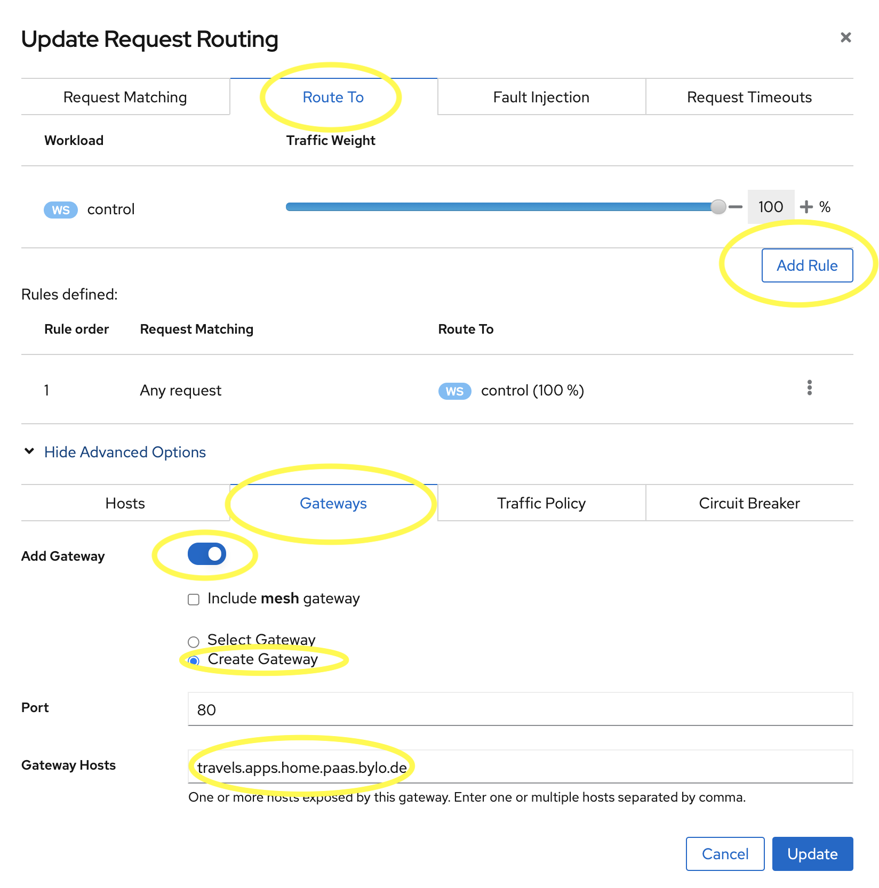

# OpenShift Service Mesh Demo 

I believe that Kiali is a great way to learn about the Service Mesh and Istio in particular. 

This demo shows how to get a normal application running in the service mesh using Kiali.  
It is based on the great work by the Kiali Team and their [Tutorial](https://kiali.io/documentation/latest/tutorial/)
([video](https://events.istio.io/istiocon-2021/workshops/istio-cookbook-kiali-recipe/)).

## Demo Preparation 

Install the Service Mesh Operator onto OpenShift (tested on v4.7) 

   1. Install ElasticSearch, Kiali and Jaeger Operators and wait for them to be successfully installed
   1. Install the OpenShift Service Mesh Operator and wait for it to be successfully installed

## Demo Steps

Part 1

   1. Show how the OSSM Operators where installed
   1. Install the mesh control plane, show how it can be configured
   1. Show the pods loading in istio-system project
   1. Show the SMCP resource status using ``oc get smcp -A``
   1. Install the demo app: ``./1-goapp.sh``
   1. Show app working - without mesh
   1. Fetch Kiali's route and show the Kiali Graph is empty
   1. Add the projects into the mesh: ``./2-gomesh.sh``

Part 2

   1. Add the `control` pod into the mesh (Workload -> Control -> Actions -> Enable Auto Injection)
   1. Create the `Gateway` and `VirtualService` (Services -> Control -> Actions -> Request Routing - See below image)
   1. Show the generated Gateway & VirtualService resources Istio Config Menu
   1. Show resource semantic verification in Kiali
   1. Show the control service now in the Graph (ensure all 3 namespaces are selected)
   1. Add the portal services into the mesh using Kiali (travel-portal ns) 
   1. Add all other services into the mesh using a script (travel-agency ns)
   1. Show the Graph
   1. Whilst the services show up in the graph, show the Kiali Graph features 
   1. Show tracing
   1. Show adding delay into "Hotel" svc
   1. Show highlighting the bottlenecks in the graph using "responsetime > 1000"
   1. Show traffic history

Clean up

   1. Remove the demo app using ``./3-cleanup.sh``
   1. Optionally delete all of the service mesh safely using ``./delete-all-service-mesh.sh``

---

Example using Kiali to allow traffic to enter the mesh via the OpenShift route and the mesh ingres gateway
(Ensure the Hosts tab also shows the same hostname).

